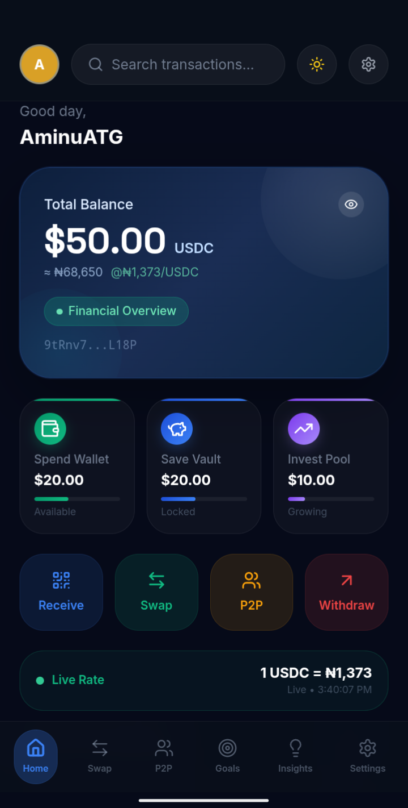
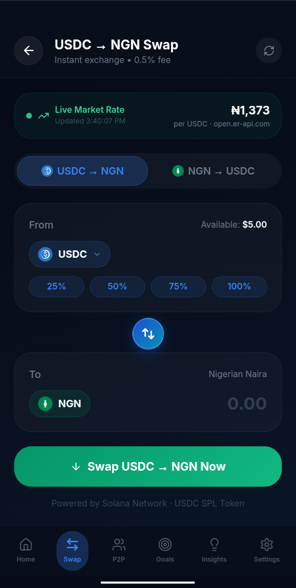
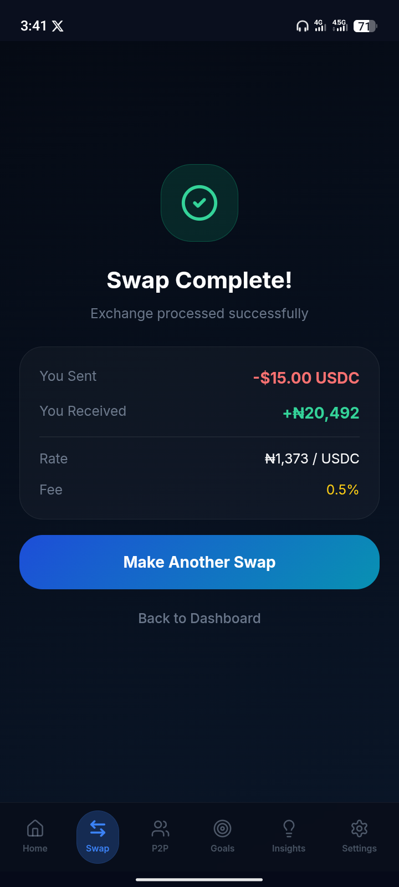

# Finora Pay

Finora Pay is a programmable income wallet designed for African freelancers to receive global payments in USDC and automatically structure income into spending, savings, and investment.

---

## Core Innovation: Smart Income Routing (SIR)

Finora Pay introduces Smart Income Routing - a system that automatically splits every incoming payment into:

- Spend Wallet  
- Save Vault  
- Invest Pool  

Example:  
$100 received  
→ $70 Spend  
→ $20 Save  
→ $10 Invest  

No manual budgeting. No extra steps. Income arrives already structured.

---

## Problem

Freelancers in Africa face:
- Slow settlement (2–5 days)
- High transaction fees (5–15%)
- No structured way to manage income

Result:
Even when income is global, financial management remains manual, fragmented, and inefficient.

---

## Solution

Finora Pay bridges global payments with structured financial behavior:

- Receive USDC instantly  
- Automatically allocate income  
- Access local liquidity through P2P
  

---
## Why It Matters

Stablecoins fix how money moves.

Finora Pay fixes what happens after money arrives.

Instead of manually splitting income, users get:
- Automatic budgeting
- Built-in savings discipline
- Continuous wealth accumulation

Income becomes structured by default not by effort.

---

## Product Preview

### Dashboard (Smart Income Routing)

### Swap USDC → NGN

### Swap Confirmation

### P2P Trading

---

## MVP Features

- USDC receive (QR + wallet)  
- Smart Income Routing (auto split)  
- Spend / Save / Invest balances  
- P2P trading interface  
- Simulated withdrawal

---

## Tech Stack

- Solana (fast, low-cost transactions)
- USDC (stable global payments)
- Frontend: Web app (Netlify)
- P2P module with escrow logic (simulated)

---

## Use Case

Designed for:
- Freelancers earning globally
- Remote workers paid in crypto
- African users needing local liquidity (NGN)

---

## Live Demo

👉 https://finorapay.netlify.app

(Test the full flow: Receive → Auto-split → Swap → P2P)

---

## Vision

Finora Pay aims to become the financial operating system for Africa’s global workforce where income is not just received, but intelligently structured for growth.
